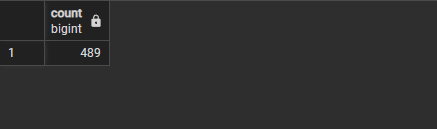
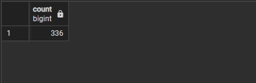
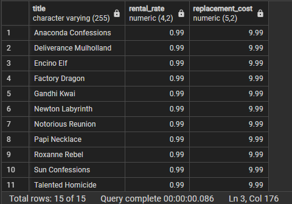

# Ödev Listesi

- [Ödev1](#ödev1)
   - [1. film tablosunda film uzunluğu length sütununda gösterilmektedir. Uzunluğu ortalama film uzunluğundan fazla kaç tane film vardır?](#odev1-soru1)
   - [2. film tablosunda en yüksek rental_rate değerine sahip kaç tane film vardır?](#odev1-soru2)
   - [3. film tablosunda en düşük rental_rate ve en düşük replacement_cost değerlerine sahip filmleri sıralayınız.](#odev1-soru3)
   - [4. payment tablosunda en fazla sayıda alışveriş yapan müşterileri(customer) sıralayınız.](#odev1-soru4)

---

## Ödev1

### <a name="odev1-soru1"></a>1. film tablosunda film uzunluğu length sütununda gösterilmektedir. Uzunluğu ortalama film uzunluğundan fazla kaç tane film vardır?
```sql
Select Count(length) from film where length>(select Avg(length) from film);
```


### <a name="odev1-soru2"></a>2. film tablosunda en yüksek rental_rate değerine sahip kaç tane film vardır?
```sql
Select Count(rental_rate) from film  where rental_rate=(Select max(rental_rate) from film); 
```


### <a name="odev1-soru3"></a>3. film tablosunda en düşük rental_rate ve en düşük replacement_cost değerlerine sahip filmleri sıralayınız.
```sql
Select title,rental_rate,replacement_cost from film  where rental_rate= (Select min(rental_rate) from film ) and replacement_cost=(Select min(replacement_cost) from film ); 
```


### <a name="odev1-soru4"></a>4. payment tablosunda en fazla sayıda alışveriş yapan müşterileri(customer) sıralayınız.
```sql
Select first_name,last_name From customer right join (Select customer_id as sub_customer_id ,Count(customer_id)as paymentCount from payment group by customer_id  having 
 Count(customer_id)=(Select Max(paymentCount) from (select count(customer_id) as paymentCount from payment group by customer_id ))) on customer.customer_id=sub_customer_id ;	
```

