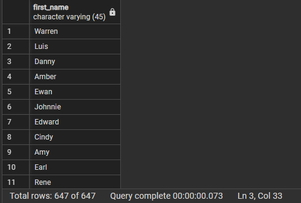
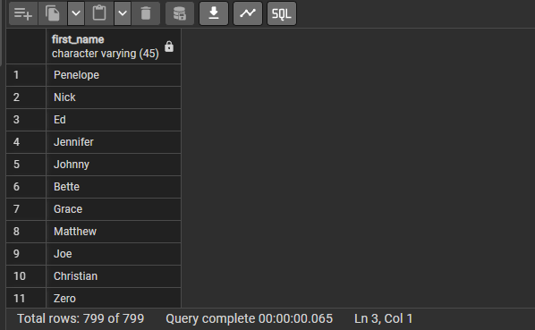

# Ödev Listesi

- [Ödev1](#ödev1)
   - [1. city tablosu ile country tablosunda bulunan şehir (city) ve ülke (country) isimlerini birlikte görebileceğimiz INNER JOIN sorgusunu yazınız.](#odev1-soru1)
   - [2. customer tablosu ile payment tablosunda bulunan payment_id ile customer tablosundaki first_name ve last_name isimlerini birlikte görebileceğimiz INNER JOIN sorgusunu yazınız.](#odev1-soru2)
   - [3. customer tablosu ile rental tablosunda bulunan rental_id ile customer tablosundaki first_name ve last_name isimlerini birlikte görebileceğimiz INNER JOIN sorgusunu yazınız.](#odev1-soru3)

- [Ödev2](#ödev2)
   - [1. city tablosu ile country tablosunda bulunan şehir (city) ve ülke (country) isimlerini birlikte görebileceğimiz LEFT JOIN sorgusunu yazınız.](#odev2-soru1)
   - [2. customer tablosu ile payment tablosunda bulunan payment_id ile customer tablosundaki first_name ve last_name isimlerini birlikte görebileceğimiz RIGHT JOIN sorgusunu yazınız.](#odev2-soru2)
   - [3. customer tablosu ile rental tablosunda bulunan rental_id ile customer tablosundaki first_name ve last_name isimlerini birlikte görebileceğimiz FULL JOIN sorgusunu yazınız.](#odev2-soru3)

- [Ödev3](#ödev3)
   - [1. actor ve customer tablolarında bulunan first_name sütunları için tüm verileri sıralayalım.](#odev3-soru1)
   - [2. actor ve customer tablolarında bulunan first_name sütunları için kesişen verileri sıralayalım.](#odev3-soru2)
   - [3. actor ve customer tablolarında bulunan first_name sütunları için ilk tabloda bulunan ancak ikinci tabloda bulunmayan verileri sıralayalım.](#odev3-soru3)
   - [4. İlk 3 sorguyu tekrar eden veriler için de yapalım.](#odev3-soru4)

---

## Ödev1

### <a name="odev1-soru1"></a>1. city tablosu ile country tablosunda bulunan şehir (city) ve ülke (country) isimlerini birlikte görebileceğimiz INNER JOIN sorgusunu yazınız.
```sql
Select country,city From city Inner Join country on city.country_id=country.country_id;
```


### <a name="odev1-soru2"></a>2. customer tablosu ile payment tablosunda bulunan payment_id ile customer tablosundaki first_name ve last_name isimlerini birlikte görebileceğimiz INNER JOIN sorgusunu yazınız.
```sql
Select payment.payment_id,first_name,last_name From customer Inner join payment on customer.customer_id=payment.customer_id;
```


### <a name="odev1-soru3"></a>3. customer tablosu ile rental tablosunda bulunan rental_id ile customer tablosundaki first_name ve last_name isimlerini birlikte görebileceğimiz INNER JOIN sorgusunu yazınız.
```sql
Select rental_id,first_name,last_name from customer Inner join rental on customer.customer_id=rental.customer_id;
```


## Ödev2

### <a name="odev2-soru1"></a>1. city tablosu ile country tablosunda bulunan şehir (city) ve ülke (country) isimlerini birlikte görebileceğimiz LEFT JOIN sorgusunu yazınız.
```sql
Select city,country From city LEft join country on city.country_id=country.country_id;
```


### <a name="odev2-soru2"></a>2. customer tablosu ile payment tablosunda bulunan payment_id ile customer tablosundaki first_name ve last_name isimlerini birlikte görebileceğimiz RIGHT JOIN sorgusunu yazınız.
```sql
select payment_id,first_name,last_name from  customer right join payment on payment.customer_id=customer.customer_id;
```


### <a name="odev2-soru3"></a>3. customer tablosu ile rental tablosunda bulunan rental_id ile customer tablosundaki first_name ve last_name isimlerini birlikte görebileceğimiz FULL JOIN sorgusunu yazınız.
```sql
Select rental_id,first_name,last_name From customer Full join rental on customer.customer_id=rental.customer_id;
```


## Ödev3

### <a name="odev3-soru1"></a>1. actor ve customer tablolarında bulunan first_name sütunları için tüm verileri sıralayalım.
```sql
(Select first_name From actor) Union (Select first_name from customer);
```


### <a name="odev3-soru2"></a>2. actor ve customer tablolarında bulunan first_name sütunları için kesişen verileri sıralayalım.
```sql
(Select first_name From actor) Intersect (Select first_name from customer);
```


### <a name="odev3-soru3"></a>3. actor ve customer tablolarında bulunan first_name sütunları için ilk tabloda bulunan ancak ikinci tabloda bulunmayan verileri sıralayalım.
```sql
(Select first_name From actor) Except (Select first_name from customer);
```


### <a name="odev3-soru4"></a>4. İlk 3 sorguyu tekrar eden veriler için de yapalım.
```sql
(select first_name from actor) Union All (select first_name from customer);
```

```sql
(select first_name from actor) Intersect All (select first_name from customer);
```

```sql
(select first_name from actor) Except All (select first_name from customer);
```


