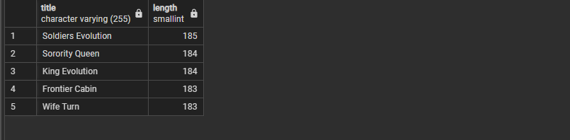
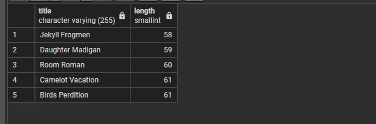
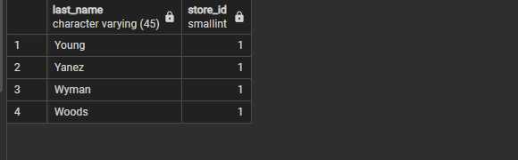
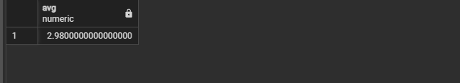
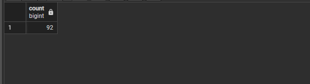
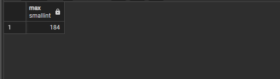
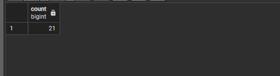
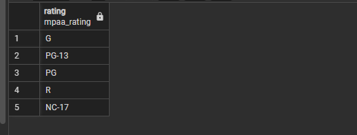
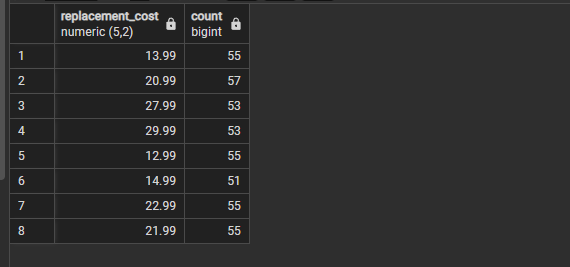
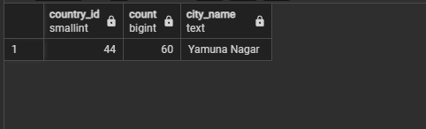

# Ödev Listesi <a name="main"></a>
- [Ödev 1](#ödev1)
   - [1. film tablosunda bulunan ve film ismi (title) 'n' karakteri ile biten en uzun (length) 5 filmi sıralayınız.](#odev1-soru1)
   - [2. film tablosunda bulunan ve film ismi (title) 'n' karakteri ile biten en kısa (length) ikinci(6,7,8,9,10) 5 filmi sıralayınız.](#odev1-soru2)
   - [3. customer tablosunda bulunan last_name sütununa göre azalan yapılan sıralamada store_id 1 olmak koşuluyla ilk 4 veriyi sıralayınız.](#odev1-soru3)

- [Ödev 2](#ödev2)
   - [1. film tablosunda bulunan rental_rate sütunundaki değerlerin ortalaması nedir?](#odev2-soru1)
   - [2. film tablosunda bulunan filmlerden kaç tanesi 'C' karakteri ile başlar?](#odev2-soru2)
   - [3. film tablosunda bulunan filmlerden rental_rate değeri 0.99'a eşit olan en uzun (length) film kaç dakikadır?](#odev2-soru3)
   - [4. film tablosunda bulunan filmlerin uzunluğu 150 dakikadan büyük olanlarına ait kaç farklı replacement_cost değeri vardır?](#odev2-soru4)

- [Ödev 3](#ödev3)
   - [1. film tablosunda bulunan filmleri rating değerlerine göre gruplayınız.](#odev3-soru1)
   - [2. film tablosunda bulunan filmleri replacement_cost sütununa göre grupladığımızda film sayısı 50'den fazla olan replacement_cost değerini ve karşılık gelen film sayısını sıralayınız.](#odev3-soru2)
   - [3. customer tablosunda bulunan store_id değerlerine karşılık gelen müşteri sayılarını nelerdir?](#odev3-soru3)
   - [4. city tablosunda bulunan şehir verilerini country_id sütununa göre gruplandırdıktan sonra en fazla şehir sayısı barındıran country_id bilgisini ve şehir sayısını paylaşınız.](#odev3-soru4)

---

## [Ödev1](#main)
### <a name="odev1-soru1"></a>1. film tablosunda bulunan ve film ismi (title) 'n' karakteri ile biten en uzun (length) 5 filmi sıralayınız.
```sql
Select title,length From film Where title Like '%n' order by  length Desc limit 5;
```


### <a name="odev1-soru2"></a>2. film tablosunda bulunan ve film ismi (title) 'n' karakteri ile biten en kısa (length) ikinci(6,7,8,9,10) 5 filmi sıralayınız.
```sql
Select title,length From film Where title Like '%n' order by length asc offset 5 limit 5 
```


### <a name="odev1-soru3"></a>3. customer tablosunda bulunan last_name sütununa göre azalan yapılan sıralamada store_id 1 olmak koşuluyla ilk 4 veriyi sıralayınız.
```sql
Select last_name,store_id From customer Where store_id=1 order by  last_name  desc limit 4 
```


---

## [Ödev2](#main)
### <a name="odev2-soru1"></a>1. film tablosunda bulunan rental_rate sütunundaki değerlerin ortalaması nedir?
```sql
Select Avg(rental_rate) from film 
```


### <a name="odev2-soru2"></a>2. film tablosunda bulunan filmlerden kaç tanesi 'C' karakteri ile başlar?
```sql
Select count(title) from film  where title like 'C%';
```

### <a name="odev2-soru3"></a>3. film tablosunda bulunan filmlerden rental_rate değeri 0.99'a eşit olan en uzun (length) film kaç dakikadır?
```sql
Select Max(length) from film  where rental_rate=0.99;
```


### <a name="odev2-soru4"></a>4. film tablosunda bulunan filmlerin uzunluğu 150 dakikadan büyük olanlarına ait kaç farklı replacement_cost değeri vardır?
```sql
Select Count(Distinct(replacement_cost) ) From film Where length>150;
```


---

## [Ödev3](#main)
### <a name="odev3-soru1"></a>1. film tablosunda bulunan filmleri rating değerlerine göre gruplayınız.
```sql
select rating From film Group By rating;
```

### <a name="odev3-soru2"></a>2. film tablosunda bulunan filmleri replacement_cost sütununa göre grupladığımızda film sayısı 50'den fazla olan replacement_cost değerini ve karşılık gelen film sayısını sıralayınız.
```sql
Select replacement_cost,Count(replacement_cost) From film Group by replacement_cost having Count(replacement_cost)>50;
```


### <a name="odev3-soru3"></a>3. customer tablosunda bulunan store_id değerlerine karşılık gelen müşteri sayılarını nelerdir?
```sql
Select store_id,Count(store_id) From customer Group by store_id;
```


### <a name="odev3-soru4"></a>4. city tablosunda bulunan şehir verilerini country_id sütununa göre gruplandırdıktan sonra en fazla şehir sayısı barındıran country_id bilgisini ve şehir sayısını paylaşınız.
```sql
Select country_id,Count(city),Max(city)as city_name from city  group by country_id order by Count(city) desc limit 1;
```

