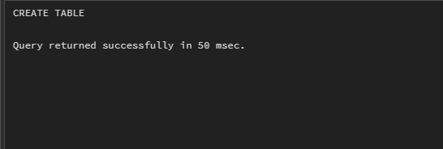
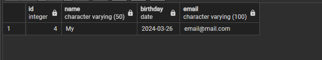
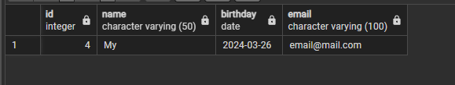

# Ödev Listesi

- [Ödev1](#ödev1)
   - [1. test veritabanınızda employee isimli sütun bilgileri id(INTEGER), name VARCHAR(50), birthday DATE, email VARCHAR(100) olan bir tablo oluşturalım.](#odev1-soru1)
   - [2. Oluşturduğumuz employee tablosuna 'Mockaroo' servisini kullanarak 50 adet veri ekleyelim.](#odev1-soru2)
   - [3. Sütunların her birine göre diğer sütunları güncelleyecek 5 adet UPDATE işlemi yapalım.](#odev1-soru3)
   - [4. Sütunların her birine göre ilgili satırı silecek 5 adet DELETE işlemi yapalım.](#odev1-soru4)

---

## Ödev1

### <a name="odev1-soru1"></a>1. test veritabanınızda employee isimli sütun bilgileri id(INTEGER), name VARCHAR(50), birthday DATE, email VARCHAR(100) olan bir tablo oluşturalım.
```sql
create Table Employee (id INTEGER,name VARCHAR(50),birthday DATE,email VARCHAR(100));
```


### <a name="odev1-soru2"></a>2. Oluşturduğumuz employee tablosuna 'Mockaroo' servisini kullanarak 50 adet veri ekleyelim.
```sql
insert into employee (id, name, birthday, email) values (1, 'Fulvia', '7/5/2024', 'fthowless0@jigsy.com');
insert into employee (id, name, birthday, email) values (2, 'Jermaine', '12/30/2023', 'jderechter1@blogs.com');
insert into employee (id, name, birthday, email) values (3, 'Berrie', '11/8/2023', 'bbinding2@ibm.com');
insert into employee (id, name, birthday, email) values (4, 'My', '3/26/2024', 'mmaund3@spiegel.de');
.
.
.
```

### <a name="odev1-soru3"></a>3. Sütunların her birine göre diğer sütunları güncelleyecek 5 adet UPDATE işlemi yapalım.
```sql
Update employee Set id=2 Where id=3 Returning *;
Update employee Set name='Berrie' Where name='Kity' Returning *;
Update employee Set birthday='11/8/2023' Where id=4 Returning *;
Update employee Set email='email@mail.com' Where id=5 Returning *;
Update employee Set email='email22@mail.com' Where name='Berrie' Returning *;
```
### <a name="odev1-soru4"></a>4. Sütunların her birine göre ilgili satırı silecek 5 adet DELETE işlemi yapalım.
```sql
Delete From employee where  name='My' Returning * ;
Delete From employee where  id=1 Returning * ;
Delete From employee where  birhday='11/2/2023' Returning * ;
Delete From employee where  email='email@gmail.com' Returning * ;
```

