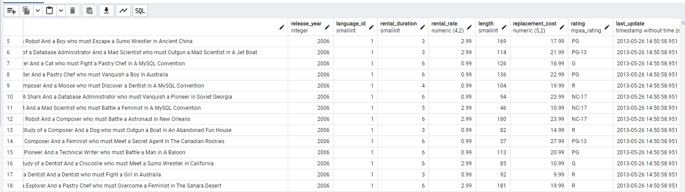
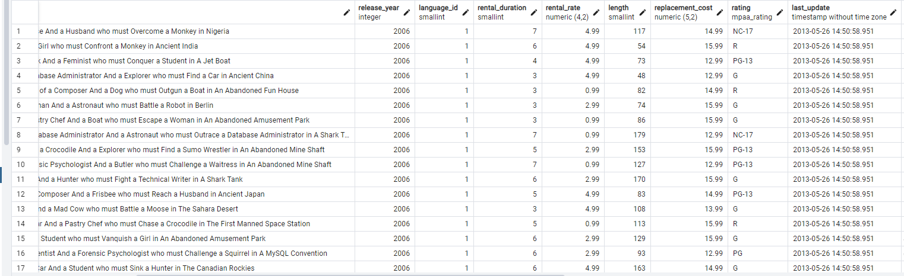
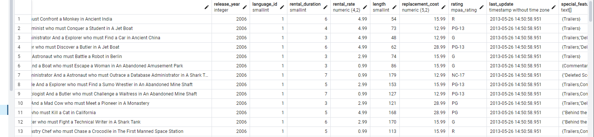

# Ödev Listesi

- [Ödev1](#ödev1)
   - [1. film tablosunda bulunan title ve description sütunlarındaki verileri sıralayınız.](#odev1-soru1)
   - [2. film tablosunda bulunan tüm sütunlardaki verileri film uzunluğu (length) 60 dan büyük VE 75 ten küçük olma koşullarıyla sıralayınız.](#odev1-soru2)
   - [3. film tablosunda bulunan tüm sütunlardaki verileri rental_rate 0.99 VE replacement_cost 12.99 VEYA 28.99 olma koşullarıyla sıralayınız.](#odev1-soru3)
   - [4. customer tablosunda bulunan first_name sütunundaki değeri 'Mary' olan müşterinin last_name sütunundaki değeri nedir?](#odev1-soru4)
   - [5. film tablosundaki uzunluğu(length) 50 ten büyük OLMAYIP aynı zamanda rental_rate değeri 2.99 veya 4.99 OLMAYAN verileri sıralayınız.](#odev1-soru5)

- [Ödev2](#ödev2)
   - [1. film tablosunda bulunan tüm sütunlardaki verileri replacement cost değeri 12.99 dan büyük eşit ve 16.99 küçük olma koşuluyla sıralayınız.](#odev2-soru1)
   - [2. actor tablosunda bulunan first_name ve last_name sütunlardaki verileri first_name 'Penelope' veya 'Nick' veya 'Ed' değerleri olması koşuluyla sıralayınız.](#odev2-soru2)
   - [3. film tablosunda bulunan tüm sütunlardaki verileri rental_rate 0.99, 2.99, 4.99 VE replacement_cost 12.99, 15.99, 28.99 olma koşullarıyla sıralayınız.](#odev2-soru3)

- [Ödev3](#ödev3)
   - [1. country tablosunda bulunan country sütunundaki ülke isimlerinden 'A' karakteri ile başlayıp 'a' karakteri ile sonlananları sıralayınız.](#odev3-soru1)
   - [2. country tablosunda bulunan country sütunundaki ülke isimlerinden en az 6 karakterden oluşan ve sonu 'n' karakteri ile sonlananları sıralayınız.](#odev3-soru2)
   - [3. film tablosunda bulunan title sütunundaki film isimlerinden en az 4 adet büyük ya da küçük harf farketmesizin 'T' karakteri içeren film isimlerini sıralayınız.](#odev3-soru3)
   - [4. film tablosunda bulunan tüm sütunlardaki verilerden title 'C' karakteri ile başlayan ve uzunluğu (length) 90 dan büyük olan ve rental_rate 2.99 olan verileri sıralayınız.](#odev3-soru4)

- [Ödev4](#ödev4)
   - [1. film tablosunda bulunan replacement_cost sütununda bulunan birbirinden farklı değerleri sıralayınız.](#odev4-soru1)
   - [2. film tablosunda bulunan replacement_cost sütununda birbirinden farklı kaç tane veri vardır?](#odev4-soru2)
   - [3. film tablosunda bulunan film isimlerinde (title) kaç tanesi T karakteri ile başlar ve aynı zamanda rating 'G' ye eşittir?](#odev4-soru3)
   - [4. country tablosunda bulunan ülke isimlerinden (country) kaç tanesi 5 karakterden oluşmaktadır?](#odev4-soru4)
   - [5. city tablosundaki şehir isimlerinin kaç tanesi 'R' veya r karakteri ile biter?](#odev4-soru5)

---

## Ödev1

### <a name="odev1-soru1"></a>1. film tablosunda bulunan title ve description sütunlarındaki verileri sıralayınız.
```sql
Select title,description From film;
```


### <a name="odev1-soru2"></a>2. film tablosunda bulunan tüm sütunlardaki verileri film uzunluğu (length) 60 dan büyük VE 75 ten küçük olma koşullarıyla sıralayınız.
```sql
Select * From film where length>60 and length<75;
```


### <a name="odev1-soru3"></a>3. film tablosunda bulunan tüm sütunlardaki verileri rental_rate 0.99 VE replacement_cost 12.99 VEYA 28.99 olma koşullarıyla sıralayınız.
```sql
Select * From film where rental_rate=0.99 and replacement_cost =12.99 or replacement_cost =28.99;
```


### <a name="odev1-soru4"></a>4. customer tablosunda bulunan first_name sütunundaki değeri 'Mary' olan müşterinin last_name sütunundaki değeri nedir?
```sql
Select last_name From customer where first_name ='Mary';
```


### <a name="odev1-soru5"></a>5. film tablosundaki uzunluğu(length) 50 ten büyük OLMAYIP aynı zamanda rental_rate değeri 2.99 veya 4.99 OLMAYAN verileri sıralayınız.
```sql
Select * From film where length<50 and rental_rate=2.99 or rental_rate!=4.99;
```


## Ödev2

### <a name="odev2-soru1"></a>1. film tablosunda bulunan tüm sütunlardaki verileri replacement cost değeri 12.99 dan büyük eşit ve 16.99 küçük olma koşuluyla sıralayınız.
```sql
Select * from film  where replacement_cost Between  12.99 and 16.98;
```


### <a name="odev2-soru2"></a>2. actor tablosunda bulunan first_name ve last_name sütunlardaki verileri first_name 'Penelope' veya 'Nick' veya 'Ed' değerleri olması koşuluyla sıralayınız.
```sql
Select first_name,last_name From actor Where first_name In('Penelope','Nick','ED');
```

### <a name="odev2-soru3"></a>3. film tablosunda bulunan tüm sütunlardaki verileri rental_rate 0.99, 2.99, 4.99 VE replacement_cost 12.99, 15.99, 28.99 olma koşullarıyla sıralayınız.
```sql
Select * from film where rental_rate In(0.99,2.99,4.99) and replacement_cost In(12.99,15.99,28.99);
```


## Ödev3

### <a name="odev3-soru1"></a>1. country tablosunda bulunan country sütunundaki ülke isimlerinden 'A' karakteri ile başlayıp 'a' karakteri ile sonlananları sıralayınız.
```sql
Select country From country where country like 'A%a';
```


### <a name="odev3-soru2"></a>2. country tablosunda bulunan country sütunundaki ülke isimlerinden en az 6 karakterden oluşan ve sonu 'n' karakteri ile sonlananları sıralayınız.
```sql
Select country From country where country like'______%n';
```


### <a name="odev3-soru3"></a>3. film tablosunda bulunan title sütunundaki film isimlerinden en az 4 adet büyük ya da küçük harf farketmesizin 'T' karakteri içeren film isimlerini sıralayınız.
```sql
select title From film where title Ilike '%t%t%t%t%'
```


### <a name="odev3-soru4"></a>4. film tablosunda bulunan tüm sütunlardaki verilerden title 'C' karakteri ile başlayan ve uzunluğu (length) 90 dan büyük olan ve rental_rate 2.99 olan verileri sıralayınız.
```sql
Select * From film where title like 'C%' and length>90 and rental_rate=2.99;
```


## Ödev4

### <a name="odev4-soru1"></a>1. film tablosunda bulunan replacement_cost sütununda bulunan birbirinden farklı değerleri sıralayınız.
```sql
Select Distinct replacement_cost From film 
```


### <a name="odev4-soru2"></a>2. film tablosunda bulunan replacement_cost sütununda birbirinden farklı kaç tane veri vardır?
```sql
Select count(Distinct replacement_cost) From film  
```


### <a name="odev4-soru3"></a>3. film tablosunda bulunan film isimlerinde (title) kaç tanesi T karakteri ile başlar ve aynı zamanda rating 'G' ye eşittir?
```sql
Select Count(*) from film where title like 'T%' and rating='G';
```


### <a name="odev4-soru4"></a>4. country tablosunda bulunan ülke isimlerinden (country) kaç tanesi 5 karakterden oluşmaktadır?
```sql
Select Count(*)from country where country like '_____';  
```


### <a name="odev4-soru5"></a>5. city tablosundaki şehir isimlerinin kaç tanesi 'R' veya r karakteri ile biter?
```sql
Select count(Distinct replacement_cost) From film  
```


